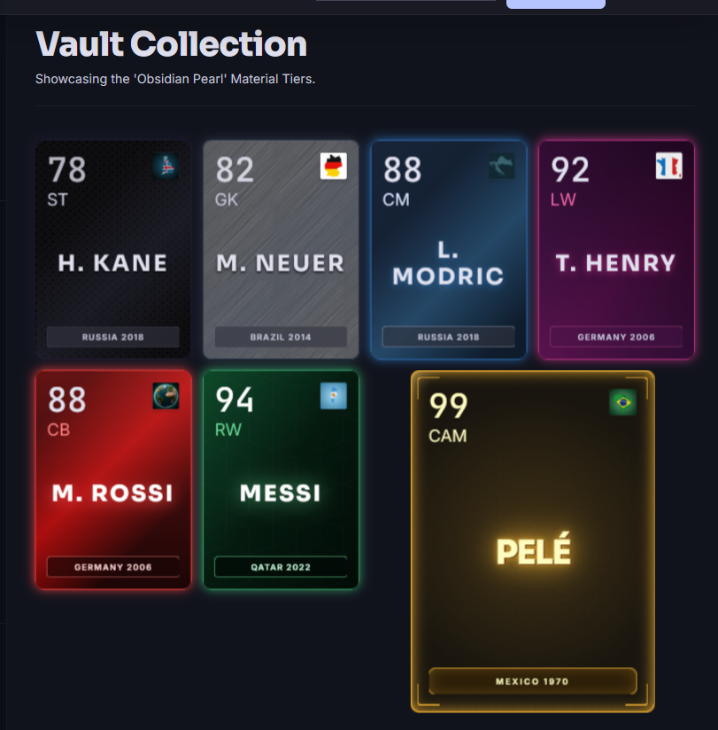

# Player Card Visual Design

The card direction is football-card-readable and material-driven. It can borrow the broad readability conventions of sports cards, while staying original enough to avoid copying FUT-style frames, proprietary silhouettes, real footballer photos, official tournament branding, club branding, or player likenesses.

The current direction is a simplified CSS material system: consistent card footprint, thin borders, inset lines, subtle diagonal overlays, simple gradients, and restrained motion. Premium and special-edition cards can have a little more shimmer, but the base grid should stay readable and calm rather than looking like complex fantasy cards.

## Visual Reference



This image and the old `cards-code.md` prototype are inspiration for the shadcn/Tailwind implementation. The prototype page shell should not be copied directly. Reuse the card anatomy, tier variables, material recipes, and motion ideas.

## Card Anatomy

Each card should show:

- top-left rating,
- position under rating,
- top-right nationality flag,
- center player name, large and readable,
- optional small role/archetype under the name,
- bottom plate with World Cup host + year,
- tier expressed through material, color, glow, and motion.

The layout may be lightly FUT-adjacent in information hierarchy because rating, position, flag, name, and edition plate are familiar sports-card affordances. The frame silhouette, border geometry, background materials, typography, animation, and naming must be original.

## Component Variants

Build these reusable variants:

- `PlayerCardFull`
- `PlayerCardCompact`
- `PlayerCardMini`
- `PlayerCardSkeleton`

Shared props:

```ts
type PlayerCardProps = {
  card: PublicPlayerCardDto;
  size?: "full" | "compact" | "mini";
  animationMode?: "none" | "subtle" | "full" | "hover";
  discovered?: boolean;
  selected?: boolean;
  onClick?: () => void;
};
```

For the first Collection page, `discovered` defaults to `true`.

## Prototype Details To Keep

Useful prototype ideas:

- card aspect ratio around `2.5 / 3.5`,
- container perspective,
- inner hover lift and slight `rotateX`,
- tier CSS variables like `--border-glow` and `--flow-color`,
- moving gradient `.flow-effect`,
- material/skin-inspired backgrounds per tier,
- premium sparkle or light sweep for diamond, pink diamond, and special editions only,
- top stat block, center name, bottom tournament plate.

Do not keep:

- one-off page shell,
- Material Symbols dependency,
- external random flag image URLs,
- hard-coded real player names in production seed data,
- exact FUT frame shapes, bevels, chemistry labels, pack branding, or trade dress,
- official Counter-Strike or CS:GO skin names in public-facing UI,
- unrelated navigation labels from the prototype.

## CSS Direction

Use the existing global card CSS for card animations and tier material variables. The card should be driven mostly by a small set of variables:

- `--card-bg`
- `--card-border-glow`
- `--card-flow-color`
- `--card-plate-bg`
- `--card-accent`

Avoid per-card bespoke markup. Special editions should still use the same `PlayerCard` component and resolve their presentation from `editionKey`.

Recommended CSS concepts:

```css
.player-card {
  aspect-ratio: 2.5 / 3.5;
  perspective: 1000px;
}

.player-card__inner {
  transform-style: preserve-3d;
  border: 1px solid var(--card-border-glow);
  box-shadow: 0 0 15px color-mix(in srgb, var(--card-border-glow), transparent 30%);
  transition: transform 180ms ease, box-shadow 180ms ease;
}

.player-card[data-animation="hover"]:hover .player-card__inner {
  transform: translateY(-6px) rotateX(3deg);
}

.player-card__flow {
  background: linear-gradient(135deg, transparent 40%, var(--card-flow-color) 50%, transparent 60%);
  background-size: 300% 300%;
}
```

Respect reduced motion:

```css
@media (prefers-reduced-motion: reduce) {
  .player-card__inner,
  .player-card__flow {
    animation: none;
    transition: none;
  }
}
```

## Tier Material Plan

Use these exact tier mappings:

| Tier | Name | Material |
| --- | --- | --- |
| 1 | Squad Player | gold / brass |
| 2 | Starter | emerald |
| 3 | Key Player | amethyst |
| 4 | Star | sapphire |
| 5 | World Class | ruby |
| 6 | Hero | diamond |
| 7 | Icon | pink diamond |

Suggested material keys:

- `brass`
- `emerald`
- `amethyst`
- `sapphire`
- `ruby`
- `diamond`
- `pink-diamond`

## Special Editions

Special editions are presentation overrides derived from `editionKey`:

| Edition | Material Key | Badge |
| --- | --- | --- |
| Golden Boot | `obsidian-gold` | Golden Boot |
| Golden Ball | `solar-gold` | Golden Ball |
| Best Young Player | `rainbow-prism` | Best Young Player |
| Golden Glove | `black-hole` | Golden Glove |

Special edition badges render above the player name. Solar gold must not include a crown icon; represent it with warm gold/orange gradients and subtle radial line accents.

## Legal-Safety Design Rules

This is not legal advice, but the implementation should reduce avoidable IP/trade-dress risk:

- Use original card silhouettes and border geometry.
- Do not recreate FUT card frames, chemistry layouts, pack marks, or official labels.
- Do not use real player likenesses or silhouettes.
- Do not use official FIFA, EA, FUT, World Cup, federation, club, Counter-Strike, or CS:GO branding.
- Use generic internal material names in code where possible, such as `diamond`, `pink-diamond`, `obsidian-gold`, or `solar-gold`.
- Let the inspiration show through color, material, lighting, and motion rather than copied shapes or names.
- Avoid production-facing labels like `Doppler`, `Crimson Web`, `Obsidian Pearl`, `Lore Master`, `FUT`, or `FIFA`.

## Performance Rules

- Do not animate every card at full intensity in a large grid.
- Use `animationMode="hover"` by default for normal cards.
- Consider subtle idle effects only for tier 6 and 7 cards.
- Pause or disable animation offscreen later if needed.
- Use pagination first; add virtualization only if the collection grows large enough to need it.
- Keep names readable over every material.

## shadcn Integration

The card itself should be a custom feature component, not a generic shadcn `Card` wrapper if that creates nested-card visual noise. Use shadcn controls around it:

- `Button` for clear actions,
- `Input` for search,
- `Select` for option filters,
- `Slider` or numeric inputs for rating/stat thresholds,
- `Sheet` or `Dialog` for card details,
- `Skeleton` for loading.

## Accessibility

- Card should be keyboard-focusable when clickable.
- Selected/focused card state must be visible.
- Flag is supplemental; nation text must exist in detail views and filters.
- Text contrast must remain strong over all material backgrounds.
- Motion must respect `prefers-reduced-motion`.
